# Client (Storefront) — Features & Flows

React + Vite + Ant Design + Redux Toolkit storefront. Stripe Elements handles payments.
Routes: [src/App.jsx](src/App.jsx). Store: [src/redux/store.js](src/redux/store.js). HTTP: [src/utils/axios.js](src/utils/axios.js).

Each section has four diagrams:

1. **Architecture overview**: the pages, components, state and APIs involved
2. **Action-loop workflow**: user action → handler → state/storage → re-render, repeated
3. **Sequence**: the call order between the user, the UI, the store and the server
4. **Events / data flow**: browser events (`cartUpdated`, `guestCartUpdated`, `user-login`), storage keys and API data

---

## Contents

- [0. Whole storefront](#0-whole-storefront)
- [1. App shell & Site settings](#1-app-shell--site-settings)
- [2. Catalog browsing (Store → Category → Listing)](#2-catalog-browsing)
- [3. Product detail](#3-product-detail)
- [4. Cart (guest + logged-in)](#4-cart)
- [5. Auth (Login, Signup, Forgot/Reset password)](#5-auth)
- [6. Checkout & Payment](#6-checkout--payment)
- [7. Wishlist](#7-wishlist)
- [8. CMS info pages](#8-cms-info-pages)
- [Notes from the code](#notes-from-the-code)

---

## 0. Whole storefront

### Architecture overview

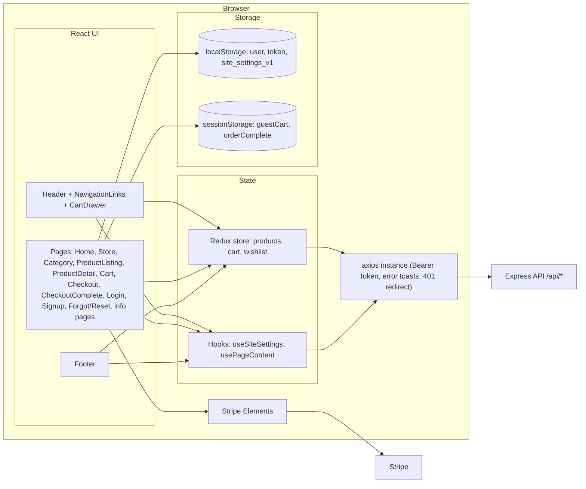
```mermaid
flowchart LR
    subgraph Browser
        subgraph UI["React UI"]
            HD["Header + NavigationLinks + CartDrawer"]
            PG["Pages: Home, Store, Category, ProductListing, ProductDetail, Cart, Checkout, CheckoutComplete, Login, Signup, Forgot/Reset, info pages"]
            FT["Footer"]
        end
        subgraph State
            RX["Redux store: products, cart, wishlist"]
            HK["Hooks: useSiteSettings, usePageContent"]
        end
        subgraph Storage
            LS[("localStorage: user, token, site_settings_v1")]
            SS[("sessionStorage: guestCart, orderComplete")]
        end
        AX["axios instance (Bearer token, error toasts, 401 redirect)"]
        SE["Stripe Elements"]
    end
    API["Express API /api/*"]
    STRIPE["Stripe"]

    HD & PG & FT --> RX & HK
    RX --> AX
    HK --> AX
    PG --> SS
    PG --> LS
    AX --> API
    SE --> STRIPE
    PG --> SE
```

### Action-loop workflow (generic UI loop)

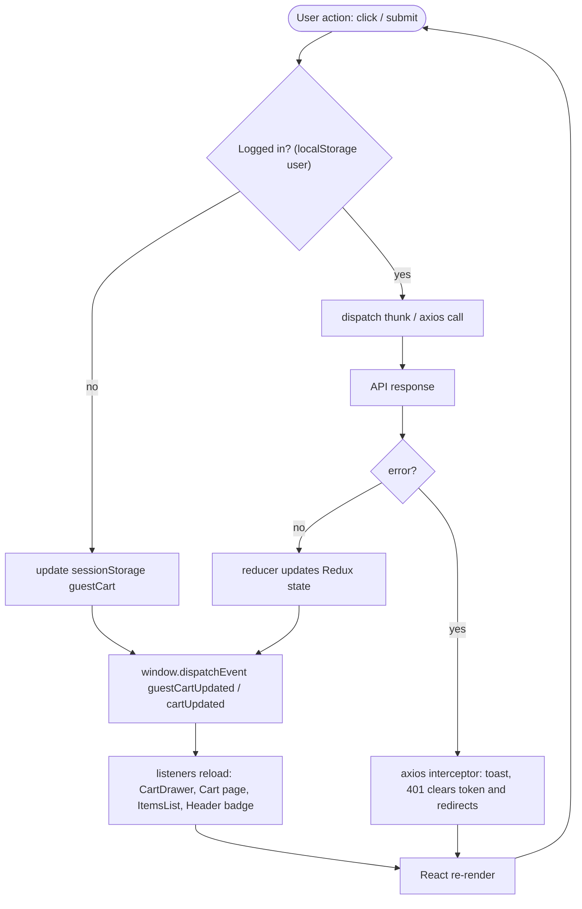
```mermaid
flowchart TD
    A([User action: click / submit]) --> B{"Logged in? (localStorage user)"}
    B -- yes --> C["dispatch thunk / axios call"]
    B -- no --> D["update sessionStorage guestCart"]
    C --> E["API response"]
    E --> F{"error?"}
    F -- yes --> G["axios interceptor: toast, 401 clears token and redirects"]
    F -- no --> H["reducer updates Redux state"]
    D --> I["window.dispatchEvent guestCartUpdated / cartUpdated"]
    H --> I
    I --> J["listeners reload: CartDrawer, Cart page, ItemsList, Header badge"]
    J --> K["React re-render"]
    K --> A
    G --> K
```

### Sequence (shopper journey end to end)

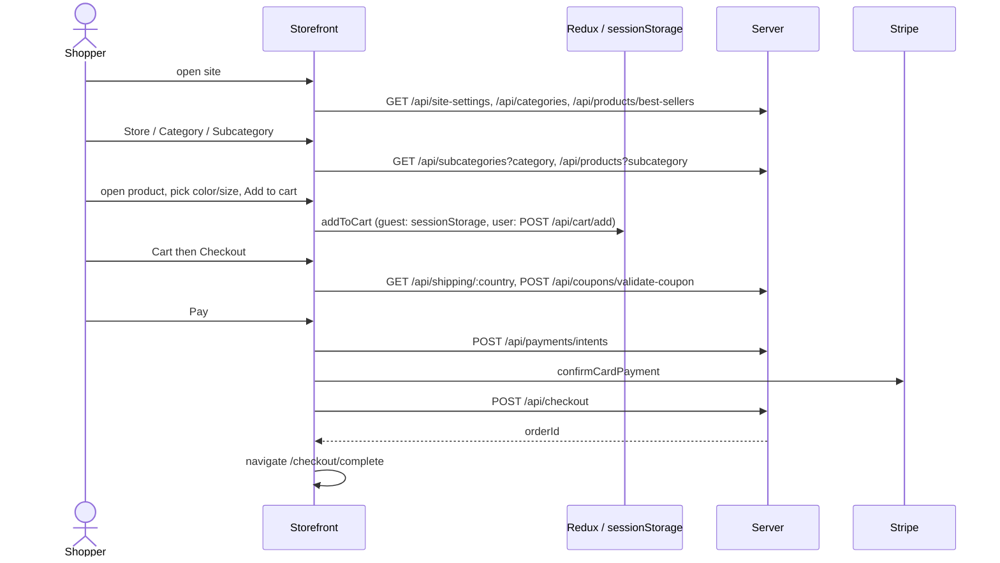
```mermaid
sequenceDiagram
    actor U as Shopper
    participant UI as Storefront
    participant RX as Redux / sessionStorage
    participant API as Server
    participant ST as Stripe

    U->>UI: open site
    UI->>API: GET /api/site-settings, /api/categories, /api/products/best-sellers
    U->>UI: Store / Category / Subcategory
    UI->>API: GET /api/subcategories?category, /api/products?subcategory
    U->>UI: open product, pick color/size, Add to cart
    UI->>RX: addToCart (guest: sessionStorage, user: POST /api/cart/add)
    U->>UI: Cart then Checkout
    UI->>API: GET /api/shipping/:country, POST /api/coupons/validate-coupon
    U->>UI: Pay
    UI->>API: POST /api/payments/intents
    UI->>ST: confirmCardPayment
    UI->>API: POST /api/checkout
    API-->>UI: orderId
    UI->>UI: navigate /checkout/complete
```

### Events / data flow

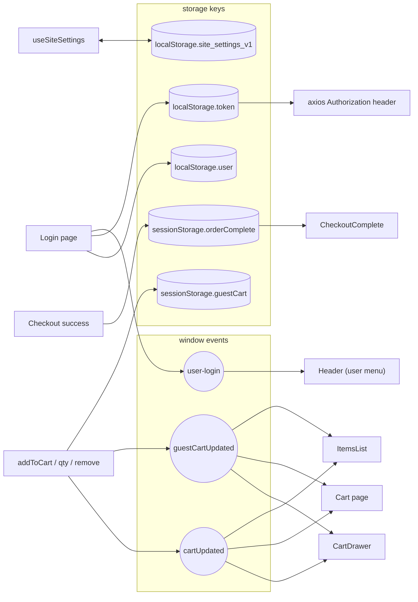
```mermaid
flowchart LR
    subgraph Events["window events"]
        E1(("cartUpdated"))
        E2(("guestCartUpdated"))
        E3(("user-login"))
    end
    subgraph Keys["storage keys"]
        K1[("localStorage.user")]
        K2[("localStorage.token")]
        K3[("localStorage.site_settings_v1")]
        K4[("sessionStorage.guestCart")]
        K5[("sessionStorage.orderComplete")]
    end

    Login["Login page"] --> K1 & K2
    Login --> E3 --> Header["Header (user menu)"]
    Add["addToCart / qty / remove"] --> E1 & E2
    Add --> K4
    E1 & E2 --> Drawer["CartDrawer"] & CartPage["Cart page"] & Items["ItemsList"]
    Settings["useSiteSettings"] <--> K3
    Checkout["Checkout success"] --> K5 --> Complete["CheckoutComplete"]
    K2 --> AX["axios Authorization header"]
```

---

## 1. App shell & Site settings

Files: [src/App.jsx](src/App.jsx), [src/components/Header.jsx](src/components/Header.jsx), [src/components/Footer.jsx](src/components/Footer.jsx), [src/hooks/useSiteSettings.js](src/hooks/useSiteSettings.js), [src/Home.jsx](src/Home.jsx).

### Architecture overview

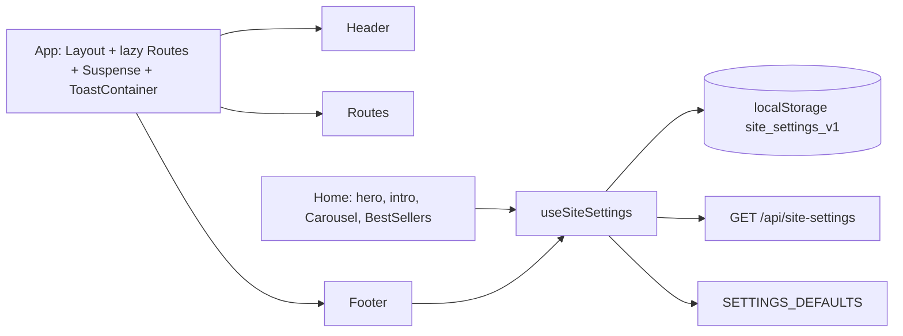
```mermaid
flowchart LR
    APP["App: Layout + lazy Routes + Suspense + ToastContainer"] --> HDR["Header"] & ROUTES["Routes"] & FTR["Footer"]
    HOME["Home: hero, intro, Carousel, BestSellers"] --> USS
    FTR --> USS["useSiteSettings"]
    USS --> CACHE[("localStorage site_settings_v1")]
    USS --> API["GET /api/site-settings"]
    USS --> DEF["SETTINGS_DEFAULTS"]
```

### Action-loop workflow (settings resolution)

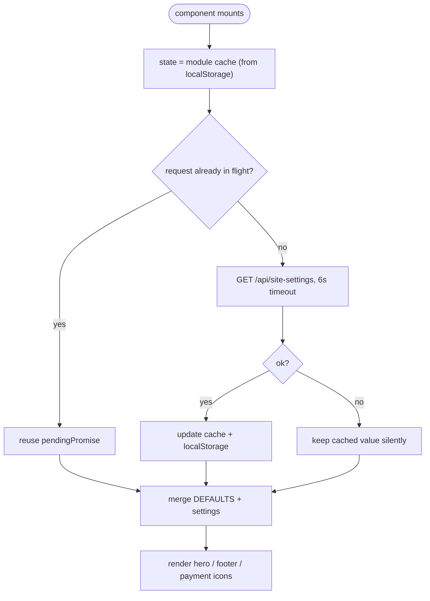
```mermaid
flowchart TD
    A([component mounts]) --> B["state = module cache (from localStorage)"]
    B --> C{"request already in flight?"}
    C -- yes --> D["reuse pendingPromise"]
    C -- no --> E["GET /api/site-settings, 6s timeout"]
    E --> F{"ok?"}
    F -- yes --> G["update cache + localStorage"]
    F -- no --> H["keep cached value silently"]
    D & G & H --> I["merge DEFAULTS + settings"] --> J["render hero / footer / payment icons"]
```

### Sequence

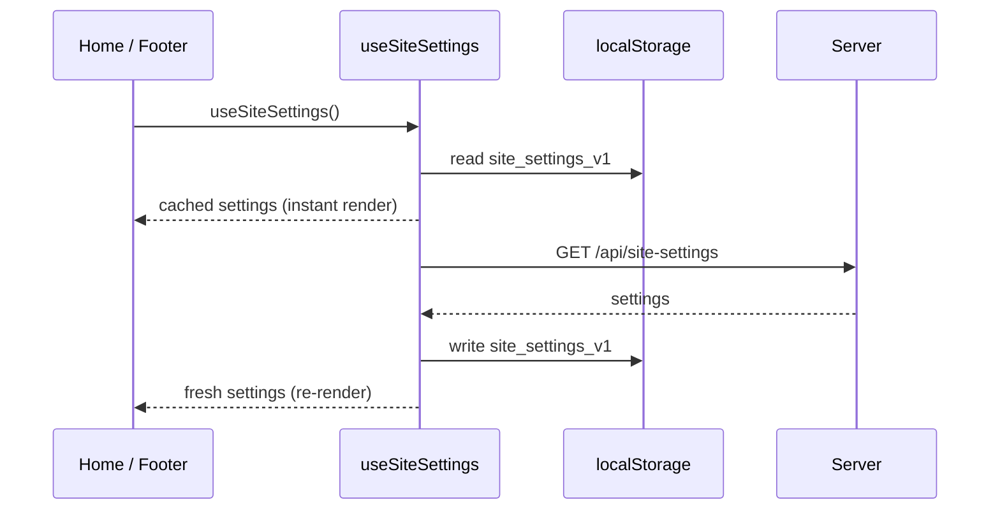
```mermaid
sequenceDiagram
    participant H as Home / Footer
    participant S as useSiteSettings
    participant LS as localStorage
    participant API as Server
    H->>S: useSiteSettings()
    S->>LS: read site_settings_v1
    S-->>H: cached settings (instant render)
    S->>API: GET /api/site-settings
    API-->>S: settings
    S->>LS: write site_settings_v1
    S-->>H: fresh settings (re-render)
```

### Events / data flow

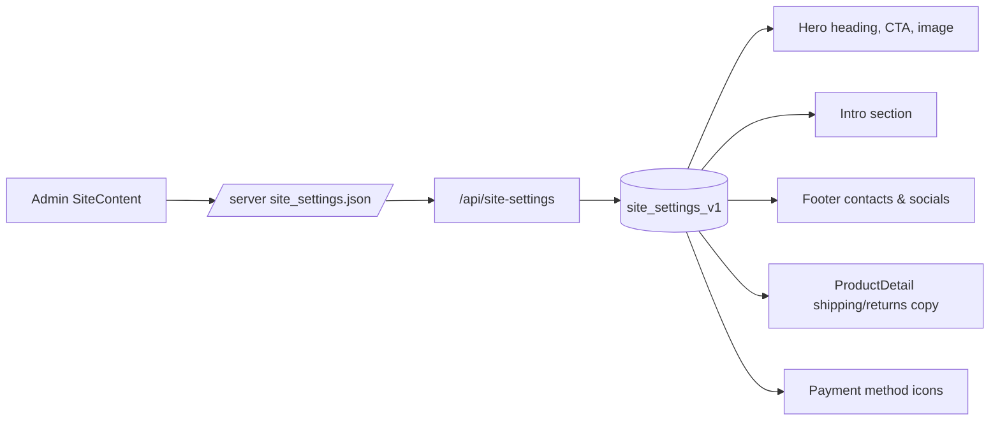
```mermaid
flowchart LR
    ADM["Admin SiteContent"] --> JSON[/"server site_settings.json"/] --> API["/api/site-settings"]
    API --> CACHE[("site_settings_v1")]
    CACHE --> HERO["Hero heading, CTA, image"]
    CACHE --> INTRO["Intro section"]
    CACHE --> FOOT["Footer contacts & socials"]
    CACHE --> PD["ProductDetail shipping/returns copy"]
    CACHE --> PAY["Payment method icons"]
```

---

## 2. Catalog browsing

Files: [src/components/NavigationLinks.jsx](src/components/NavigationLinks.jsx), [src/pages/Store.jsx](src/pages/Store.jsx), [src/pages/Category.jsx](src/pages/Category.jsx), [src/pages/ProductListing.jsx](src/pages/ProductListing.jsx), [src/components/ProductCard.jsx](src/components/ProductCard.jsx), [src/components/BestSellers.jsx](src/components/BestSellers.jsx), [src/components/Carousel.jsx](src/components/Carousel.jsx), [src/redux/slices/productSlice.js](src/redux/slices/productSlice.js).

### Architecture overview

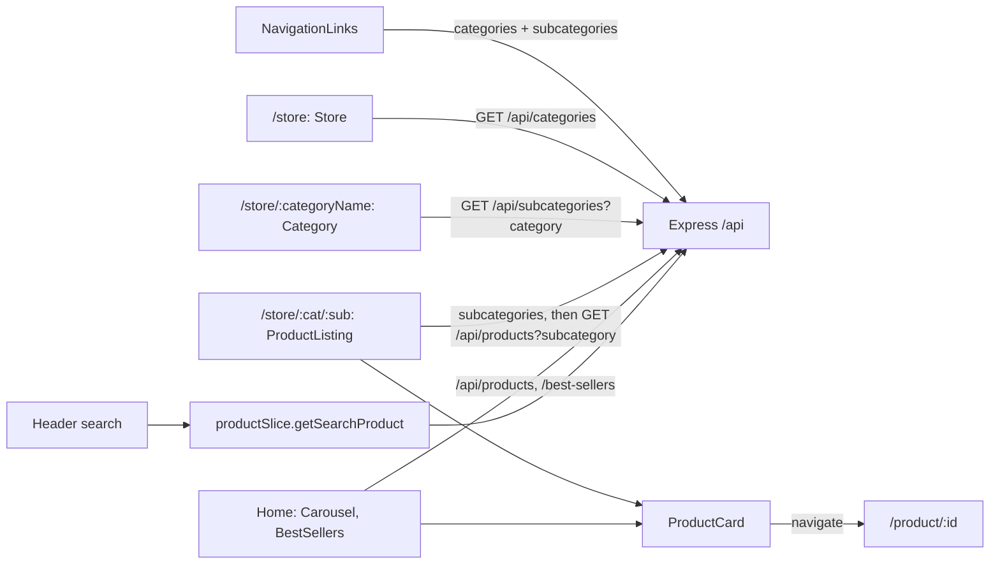
```mermaid
flowchart LR
    NAV["NavigationLinks"] -->|categories + subcategories| API
    STORE["/store: Store"] -->|GET /api/categories| API
    CAT["/store/:categoryName: Category"] -->|"GET /api/subcategories?category"| API
    LIST["/store/:cat/:sub: ProductListing"] -->|"subcategories, then GET /api/products?subcategory"| API
    HOME["Home: Carousel, BestSellers"] -->|"/api/products, /best-sellers"| API
    LIST & HOME --> CARD["ProductCard"] -->|navigate| PD["/product/:id"]
    SEARCH["Header search"] --> PS["productSlice.getSearchProduct"] --> API
    API["Express /api"]
```

### Action-loop workflow

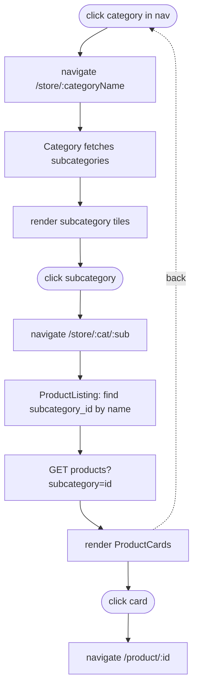
```mermaid
flowchart TD
    A([click category in nav]) --> B["navigate /store/:categoryName"]
    B --> C["Category fetches subcategories"] --> D["render subcategory tiles"]
    D --> E([click subcategory]) --> F["navigate /store/:cat/:sub"]
    F --> G["ProductListing: find subcategory_id by name"] --> H["GET products?subcategory=id"]
    H --> I["render ProductCards"] --> J([click card]) --> K["navigate /product/:id"]
    I -. back .-> A
```

### Sequence

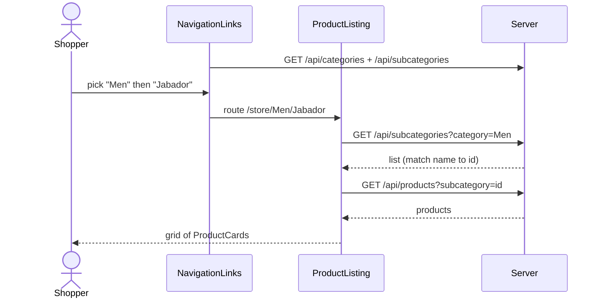
```mermaid
sequenceDiagram
    actor U as Shopper
    participant N as NavigationLinks
    participant L as ProductListing
    participant API as Server
    N->>API: GET /api/categories + /api/subcategories
    U->>N: pick "Men" then "Jabador"
    N->>L: route /store/Men/Jabador
    L->>API: GET /api/subcategories?category=Men
    API-->>L: list (match name to id)
    L->>API: GET /api/products?subcategory=id
    API-->>L: products
    L-->>U: grid of ProductCards
```

### Events / data flow

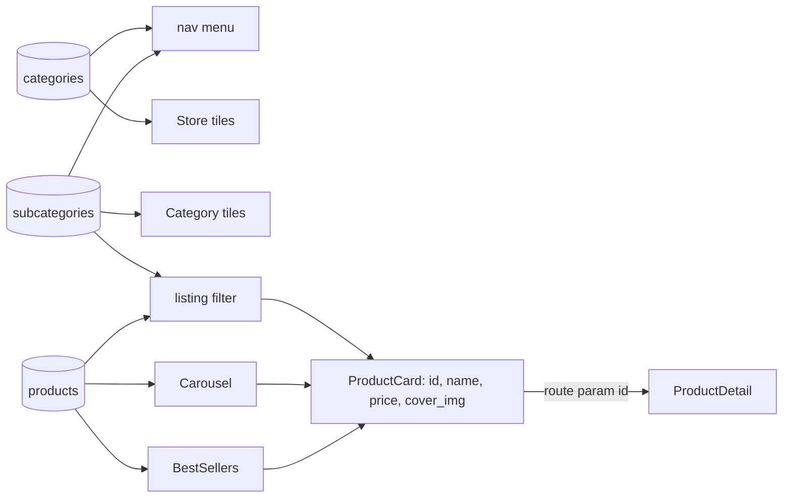
```mermaid
flowchart LR
    C[(categories)] --> NAV["nav menu"] & STORE["Store tiles"]
    S[(subcategories)] --> NAV & CAT["Category tiles"] & LIST["listing filter"]
    P[(products)] --> LIST & CAR["Carousel"] & BS["BestSellers"]
    LIST & CAR & BS --> CARD["ProductCard: id, name, price, cover_img"] -->|route param id| PD["ProductDetail"]
```

---

## 3. Product detail

Files: [src/pages/ProductDetail.jsx](src/pages/ProductDetail.jsx), `productSlice.fetchProductById`, `cartSlice.addToCart`, `wishlistSlice.addToWishlist`.

### Architecture overview

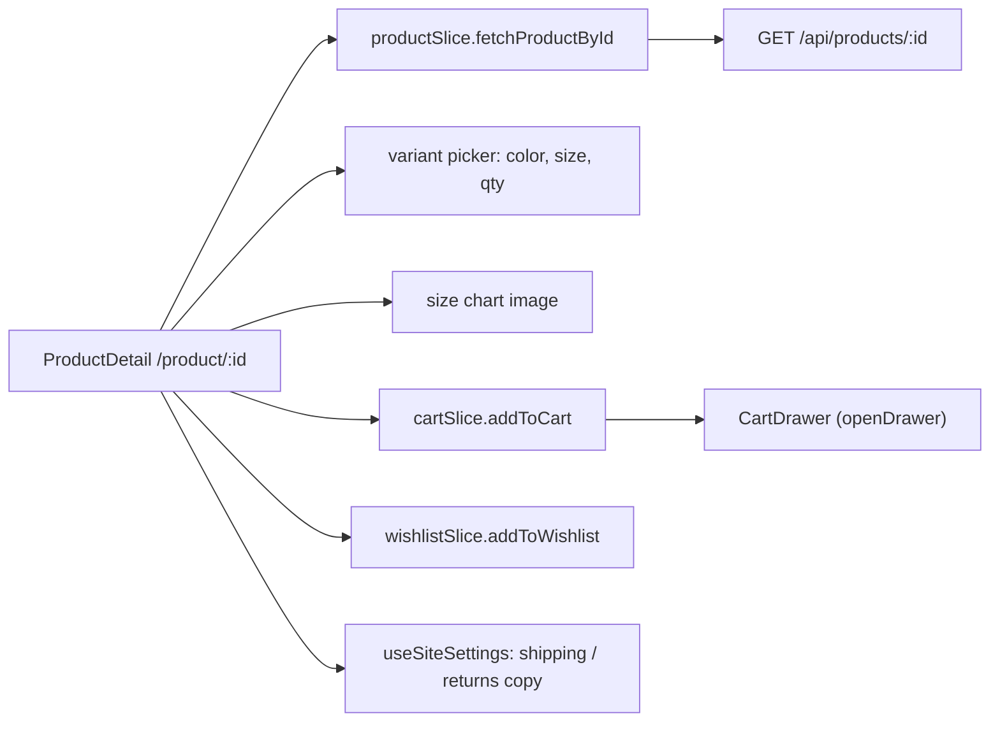
```mermaid
flowchart LR
    PD["ProductDetail /product/:id"] --> PS["productSlice.fetchProductById"] --> API["GET /api/products/:id"]
    PD --> VS["variant picker: color, size, qty"]
    PD --> SC["size chart image"]
    PD --> CS["cartSlice.addToCart"] --> DR["CartDrawer (openDrawer)"]
    PD --> WS["wishlistSlice.addToWishlist"]
    PD --> USS["useSiteSettings: shipping / returns copy"]
```

### Action-loop workflow

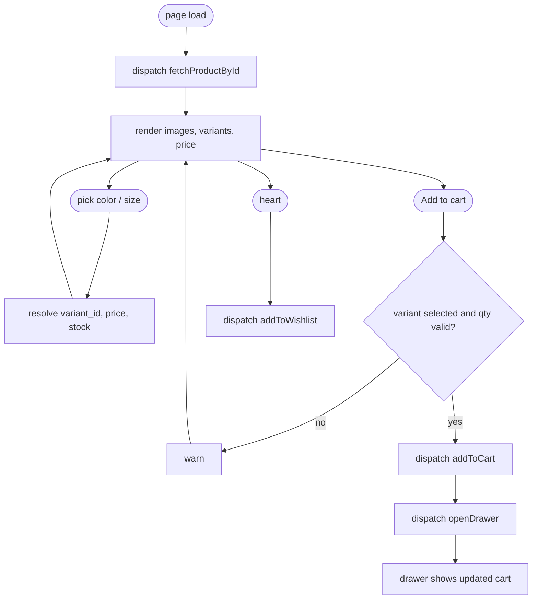
```mermaid
flowchart TD
    A([page load]) --> B["dispatch fetchProductById"] --> C["render images, variants, price"]
    C --> D([pick color / size]) --> E["resolve variant_id, price, stock"] --> C
    C --> F([Add to cart]) --> G{"variant selected and qty valid?"}
    G -- no --> H["warn"] --> C
    G -- yes --> I["dispatch addToCart"] --> J["dispatch openDrawer"] --> K["drawer shows updated cart"]
    C --> L([heart]) --> M["dispatch addToWishlist"]
```

### Sequence

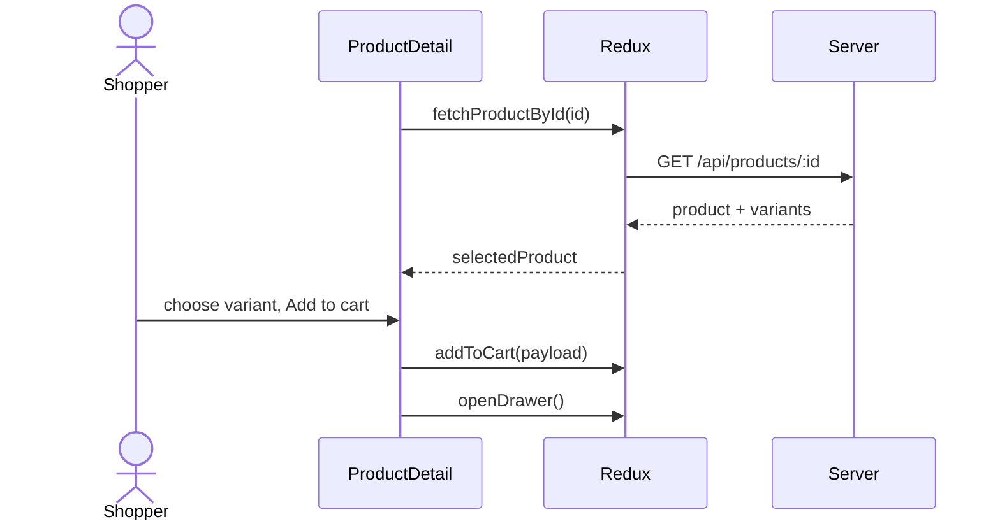
```mermaid
sequenceDiagram
    actor U as Shopper
    participant PD as ProductDetail
    participant RX as Redux
    participant API as Server
    PD->>RX: fetchProductById(id)
    RX->>API: GET /api/products/:id
    API-->>RX: product + variants
    RX-->>PD: selectedProduct
    U->>PD: choose variant, Add to cart
    PD->>RX: addToCart(payload)
    PD->>RX: openDrawer()
```

### Events / data flow

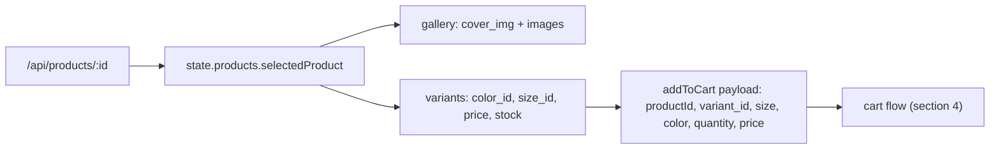
```mermaid
flowchart LR
    API["/api/products/:id"] --> SP["state.products.selectedProduct"]
    SP --> IMG["gallery: cover_img + images"]
    SP --> VAR["variants: color_id, size_id, price, stock"]
    VAR --> PAY["addToCart payload: productId, variant_id, size, color, quantity, price"]
    PAY --> CART["cart flow (section 4)"]
```

---

## 4. Cart

Files: [src/redux/slices/cartSlice.js](src/redux/slices/cartSlice.js), [src/components/CartDrawer.jsx](src/components/CartDrawer.jsx), [src/components/ItemsList.jsx](src/components/ItemsList.jsx), [src/pages/Cart.jsx](src/pages/Cart.jsx).

The cart has two modes. A **guest** cart lives in `sessionStorage.guestCart`. A **logged-in** cart lives in the server's `cart_items` table.

### Architecture overview

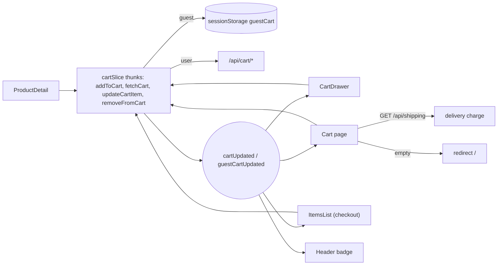
```mermaid
flowchart LR
    PD["ProductDetail"] --> TH["cartSlice thunks: addToCart, fetchCart, updateCartItem, removeFromCart"]
    DRW["CartDrawer"] & CP["Cart page"] & IL["ItemsList (checkout)"] --> TH
    TH -->|guest| SS[("sessionStorage guestCart")]
    TH -->|user| API["/api/cart/*"]
    TH --> EV(("cartUpdated / guestCartUpdated"))
    EV --> DRW & CP & IL & HDR["Header badge"]
    CP -->|"GET /api/shipping"| SH["delivery charge"]
    CP -->|empty| HOME["redirect /"]
```

### Action-loop workflow (add to cart)

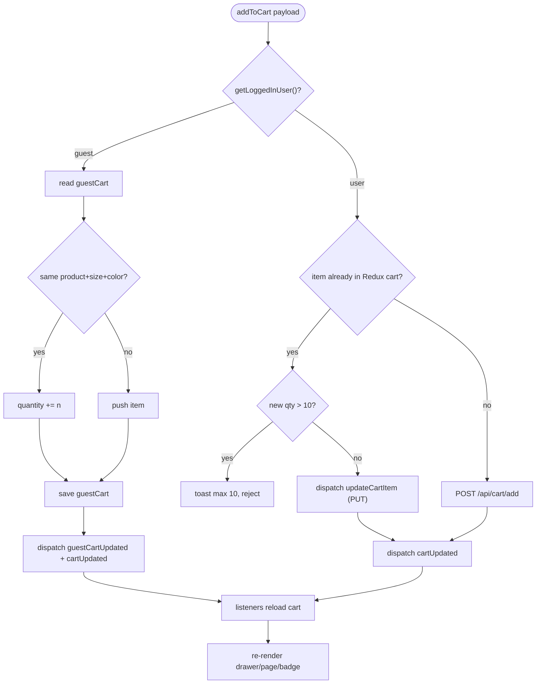
```mermaid
flowchart TD
    A([addToCart payload]) --> B{"getLoggedInUser()?"}
    B -- guest --> G1["read guestCart"] --> G2{"same product+size+color?"}
    G2 -- yes --> G3["quantity += n"]
    G2 -- no --> G4["push item"]
    G3 & G4 --> G5["save guestCart"] --> EV["dispatch guestCartUpdated + cartUpdated"]
    B -- user --> U1{"item already in Redux cart?"}
    U1 -- yes --> U2{"new qty > 10?"}
    U2 -- yes --> U3["toast max 10, reject"]
    U2 -- no --> U4["dispatch updateCartItem (PUT)"]
    U1 -- no --> U5["POST /api/cart/add"] --> EV2["dispatch cartUpdated"]
    U4 --> EV2
    EV & EV2 --> R["listeners reload cart"] --> RR["re-render drawer/page/badge"]
```

### Sequence (logged-in quantity change)

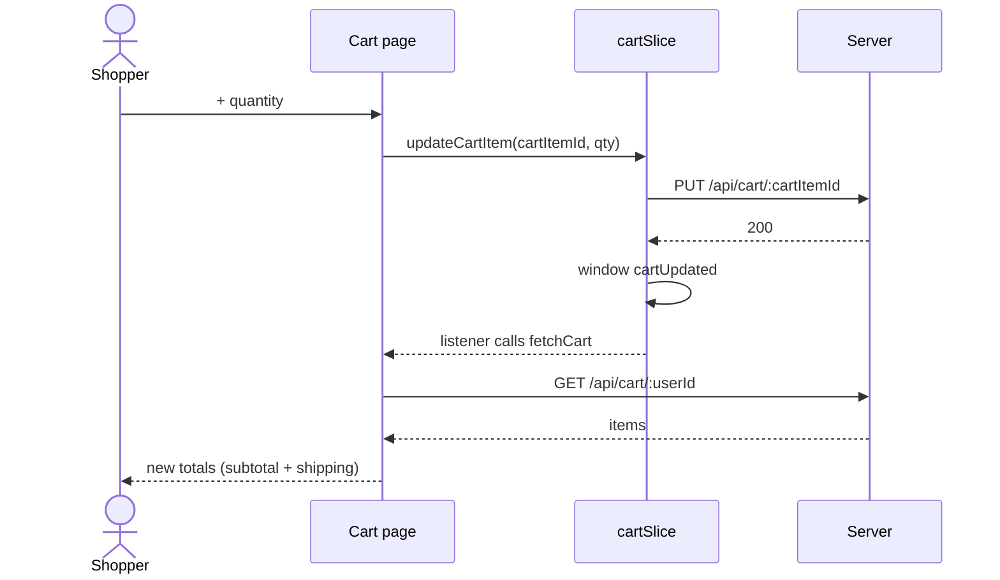
```mermaid
sequenceDiagram
    actor U as Shopper
    participant CP as Cart page
    participant RX as cartSlice
    participant API as Server
    U->>CP: + quantity
    CP->>RX: updateCartItem(cartItemId, qty)
    RX->>API: PUT /api/cart/:cartItemId
    API-->>RX: 200
    RX->>RX: window cartUpdated
    RX-->>CP: listener calls fetchCart
    CP->>API: GET /api/cart/:userId
    API-->>CP: items
    CP-->>U: new totals (subtotal + shipping)
```

### Events / data flow

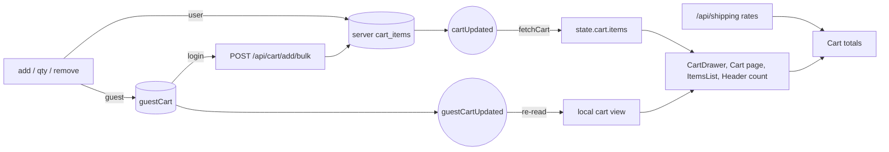
```mermaid
flowchart LR
    A["add / qty / remove"] -->|guest| GC[("guestCart")]
    A -->|user| CI[("server cart_items")]
    GC --> E2(("guestCartUpdated"))
    CI --> E1(("cartUpdated"))
    E1 -->|fetchCart| RS["state.cart.items"]
    E2 -->|re-read| LV["local cart view"]
    RS & LV --> V["CartDrawer, Cart page, ItemsList, Header count"]
    SR["/api/shipping rates"] --> TOT["Cart totals"]
    V --> TOT
    GC -->|login| BULK["POST /api/cart/add/bulk"] --> CI
```

---

## 5. Auth

Files: [src/pages/Login.jsx](src/pages/Login.jsx) (`/my-account`), [src/pages/Signup.jsx](src/pages/Signup.jsx) (`/register`), [src/pages/ForgotPassword.jsx](src/pages/ForgotPassword.jsx), [src/pages/ResetPassword.jsx](src/pages/ResetPassword.jsx), [src/utils/getLoggedInUser.js](src/utils/getLoggedInUser.js).

### Architecture overview

```mermaid
flowchart LR
    LG["Login /my-account"] -->|POST /api/users/login| API
    LG -->|merge guest cart| BULK["POST /api/cart/add/bulk"]
    SU["Signup /register"] -->|"GET check-email, POST register"| API
    FP["ForgotPassword"] -->|POST forgot-password| API
    RP["ResetPassword ?token"] -->|POST reset-password| API
    LG --> LS[("localStorage user, token")]
    LG --> EV(("user-login")) --> HDR["Header"]
    API["/api/users"]
```

### Action-loop workflow (login + cart merge)

```mermaid
flowchart TD
    A([submit login]) --> B["POST /api/users/login"]
    B --> C{"ok?"}
    C -- no --> D["error toast"] --> A
    C -- yes --> E["save user + token in localStorage"]
    E --> F["dispatch user-login event"]
    F --> G{"guestCart has items?"}
    G -- yes --> H["POST /api/cart/add/bulk"] --> I["remove guestCart"] --> J["dispatch fetchCart"]
    G -- no --> J
    J --> K["navigate /"]
```

### Sequence (signup → forgot → reset)

```mermaid
sequenceDiagram
    actor U as Shopper
    participant UI as Storefront
    participant API as Server
    participant M as Inbox
    U->>UI: signup form
    UI->>API: GET /api/users/check-email
    UI->>API: POST /api/users/register
    UI->>UI: navigate /my-account
    U->>UI: forgot password
    UI->>API: POST /api/users/forgot-password
    API->>M: reset link (30 min token)
    U->>UI: open /reset-password?token=...
    UI->>API: POST /api/users/reset-password
    UI->>UI: navigate /my-account
```

### Events / data flow

```mermaid
flowchart LR
    F["login form"] --> R["response: user + token"]
    R --> U[("localStorage.user")] --> GL["getLoggedInUser()"] --> CART["cart mode switch"]
    R --> T[("localStorage.token")] --> AX["axios Bearer header"]
    R --> EV(("user-login")) --> H["Header shows account"]
    LO["logout in Header"] -->|remove user/token| U & T
    AX -->|401| CLR["interceptor removes token, redirect"]
```

---

## 6. Checkout & Payment

Files: [src/pages/Checkout.jsx](src/pages/Checkout.jsx), [src/components/PaymentForm.jsx](src/components/PaymentForm.jsx), [src/redux/slices/checkoutSlice.js](src/redux/slices/checkoutSlice.js), [src/pages/CheckoutComplete.jsx](src/pages/CheckoutComplete.jsx).

### Architecture overview

```mermaid
flowchart LR
    CO["Checkout page"] --> FORM["AntD form: user info, shipping, optional billing"]
    CO --> IL["ItemsList (cart summary)"]
    CO -->|country change| SHIP["GET /api/shipping/:country"]
    CO -->|apply| CPN["POST /api/coupons/validate-coupon"]
    CO --> EL["Stripe Elements"] --> PF["PaymentForm"]
    PF -->|POST /api/payments/intents| API
    PF --> STR["Stripe confirmCardPayment"]
    PF -->|onPaymentConfirmed id| CO
    CO --> TH["checkoutSlice.placeOrder"] -->|POST /api/checkout| API
    CO --> DONE["/checkout/complete"]
    API["Express /api"]
```

### Action-loop workflow

```mermaid
flowchart TD
    A([open /checkout]) --> B{"cart empty?"}
    B -- yes --> H["navigate /"]
    B -- no --> C["fill form, choose country"] --> D["fetch shipping fee"] --> E["optional coupon"] --> F["show totals"]
    F --> G([Pay]) --> V{"form valid?"}
    V -- no --> V1["scroll to first error, toast"] --> C
    V -- yes --> P1["createPaymentMethod(card)"]
    P1 --> P2{"card error?"}
    P2 -- yes --> T1["toast"] --> G
    P2 -- no --> P3["POST /api/payments/intents"] --> P4["confirmCardPayment"]
    P4 --> P5{"status"}
    P5 -- redirect --> P6["window.location to 3DS URL"]
    P5 -- "not succeeded" --> T1
    P5 -- succeeded --> O1["dispatch placeOrder"]
    O1 --> O2{"orderId?"}
    O2 -- no --> T2["notification: order could not be placed"]
    O2 -- yes --> O3["sessionStorage orderComplete"] --> O4["navigate /checkout/complete (replace)"]
```

### Sequence

```mermaid
sequenceDiagram
    actor U as Shopper
    participant CO as Checkout
    participant PF as PaymentForm
    participant ST as Stripe
    participant RX as checkoutSlice
    participant API as Server
    participant CC as CheckoutComplete

    U->>CO: select country
    CO->>API: GET /api/shipping/:country
    U->>CO: apply coupon
    CO->>API: POST /api/coupons/validate-coupon
    U->>PF: Pay
    PF->>ST: createPaymentMethod
    PF->>API: POST /api/payments/intents amount
    API-->>PF: clientSecret
    PF->>ST: confirmCardPayment
    ST-->>PF: succeeded
    PF->>CO: onPaymentConfirmed(paymentIntentId)
    CO->>RX: placeOrder(values, cartItems, discount, couponCode)
    RX->>API: POST /api/checkout
    API-->>RX: orderId
    CO->>CC: navigate with orderId
    CC->>CC: read + clear sessionStorage orderComplete
```

### Events / data flow

```mermaid
flowchart LR
    CART["cart items (Redux or guestCart)"] --> PL
    FORM["form values"] --> PL
    FEE["shipping fee"] --> AMT["amount"]
    CPN["coupon discount"] --> AMT
    CART --> AMT
    AMT --> PI["PaymentIntent"]
    PI -->|id| PL["placeOrder payload"]
    PL --> CK["/api/checkout"] --> OID["orderId"]
    OID --> OC[("sessionStorage orderComplete")] --> CC["CheckoutComplete"]
    CK --> MAIL["invoice e-mail (server)"]
```

---

## 7. Wishlist

Files: [src/redux/slices/wishlistSlice.js](src/redux/slices/wishlistSlice.js), used from `ProductDetail`.

### Architecture overview

```mermaid
flowchart LR
    PD["ProductDetail heart"] --> WS["wishlistSlice"]
    WS -->|addToWishlist POST| API["/api/wishlist"]
    WS -.->|"fetchWishlist GET, removeFromWishlist DELETE"| API
    WS --> ST["state.wishlist.items"]
```

### Action-loop workflow

```mermaid
flowchart TD
    A([click heart]) --> B["dispatch addToWishlist(product)"] --> C["POST /api/wishlist"] --> D{"ok?"}
    D -- yes --> E["push to state.wishlist.items"] --> F["re-render heart"]
    D -- no --> G["toast error"]
```

### Sequence

```mermaid
sequenceDiagram
    actor U as Shopper
    participant PD as ProductDetail
    participant WS as wishlistSlice
    participant API as Server
    U->>PD: heart
    PD->>WS: addToWishlist(product)
    WS->>API: POST /api/wishlist productId
    API-->>WS: 200
    WS-->>PD: items updated
```

### Events / data flow

```mermaid
flowchart LR
    P["product.id"] --> POST["POST /api/wishlist"] --> T[("wishlist_items")]
    POST --> S["state.wishlist.items"] --> UI["heart icon"]
```

---

## 8. CMS info pages

Files: [src/hooks/usePageContent.js](src/hooks/usePageContent.js), [src/pages/about-us/](src/pages/about-us/), [src/pages/quick-links/](src/pages/quick-links/).
Routes: `/our-history`, `/legal-notice`, `/privacy-policy`, `/conditions-of-sale`, `/exchange-return`, `/delivery-time`, `/payment-method`.

### Architecture overview

```mermaid
flowchart LR
    P["Info page components"] --> H["usePageContent(slug)"] --> API["GET /api/pages/:slug"]
    FT["Footer links"] --> P
    ADM["Admin PageEditor"] -->|"PUT /api/pages/:slug"| API
```

### Action-loop workflow

```mermaid
flowchart TD
    A([route opens]) --> B["usePageContent(slug)"] --> C["loading = true"] --> D["GET /api/pages/:slug"]
    D --> E{"ok?"}
    E -- yes --> F["page = data"]
    E -- no --> G["error = err"]
    F & G --> H["loading = false"] --> I["render HTML content or fallback"]
```

### Sequence

```mermaid
sequenceDiagram
    actor U as Shopper
    participant F as Footer
    participant P as PrivacyPolicy
    participant H as usePageContent
    participant API as Server
    U->>F: click Privacy Policy
    F->>P: route /privacy-policy
    P->>H: usePageContent("privacy-policy")
    H->>API: GET /api/pages/privacy-policy
    API-->>H: title + content
    H-->>P: page
```

### Events / data flow

```mermaid
flowchart LR
    ED["admin rich-text editor"] --> PG[("pages table")] --> API["/api/pages/:slug"] --> HK["usePageContent"] --> V["info page view"]
```

---

## Notes from the code

I noticed these things while tracing the flows above. The diagrams show the code as it is.

- [src/utils/migrateGuestCartToUser.js](src/utils/migrateGuestCartToUser.js) posts to `/api/cart/bulk`, which does not exist. The working merge in `Login.jsx` uses `/api/cart/add/bulk`.
- `userSlice.loginUser` calls `/api/auth/login`, which is not mounted on the server, and `userSlice` is not registered in the store. The real login is in `Login.jsx`.
- `checkoutSlice` is also not registered in the store. Its `placeOrder` thunk still runs because thunks don't need a reducer.
- The server has no `GET` or `DELETE` route for the wishlist, so `fetchWishlist` and `removeFromWishlist` will fail.
- The axios 401 handler redirects to `/login`, which isn't a route. The login page is `/my-account`.
